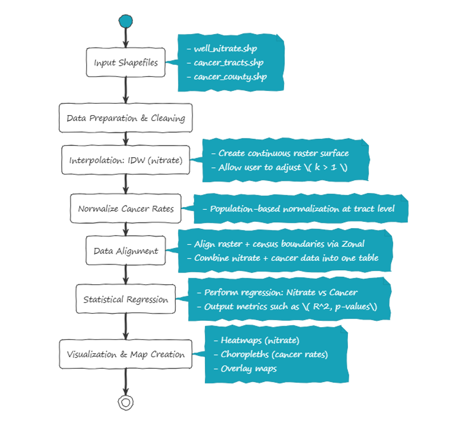

# GEOG 777 Project 1 Repository

This repository is designed to house the data cleaning scripts, massaged data, and workflows for **GEOG 777 Project 1**. These resources are focused on prepping the datasets used for spatial analysis and visualization in **ArcGIS**.

- Scripts automate the data preparation process.
- Processed data is ready to be used for generating spatial analyses and styled visualizations.

Note: This repository does not include the ArcGIS environment or tools. For actual mapping and visualization processes, the outputs from the scripts here should be used directly in the ArcGIS application.

Repository link: [dvanosdall/GEOG_777_Project_1](https://github.com/dvanosdall/GEOG_777_Project_1)

---

# Python-Based Data Analysis + ArcGIS Visualization

## Introduction

Nitrogen-based compounds, such as nitrates in groundwater, can pose significant public health risks, including links to cancer. This project aims to explore the spatial relationship between nitrate concentrations in groundwater and cancer rates in Wisconsin. Using datasets provided in shapefiles:

- **`well_nitrate.shp`**: Contains well nitrate concentrations.  
- **`cancer_tracts.shp`**: Contains cancer cases aggregated at the census tract level.  
- **`cancer_county.shp`**: Contains county-level cancer data (optional, for high-level comparisons).

The goal is to determine whether a statistical relationship exists between groundwater nitrate levels and cancer occurrences. The deliverables require an application layer to:

- Analyze and process data using Python for automation and reproducibility.
- Visualize results (e.g., nitrate heatmaps, cancer choropleths, overlay maps) in ArcGIS.
- Export polished maps, datasets, and analyses for inclusion in the project report and video demo.

This plan leverages Python for data preprocessing, interpolation, and regression analysis while utilizing ArcGIS for visualization and map styling.

---

## 1. Problem Overview

High nitrate concentrations in groundwater pose a significant health concern for Wisconsin communities. Evidence suggests a potential link between nitrate levels and cancer occurrences. To test this hypothesis:

1. **Nitrate Analysis**: Interpolate scattered nitrate well data into a continuous raster (heatmap).  
2. **Cancer Data**: Normalize census-based cancer incidences to adjust for population differences.  
3. **Spatial Alignment**: Align datasets (nitrate raster with census tracts) to conduct correlation analyses.  
4. **Regression**: Perform regression analysis to assess relationships between nitrate levels and cancer rates.  
5. **Outputs**: Communicate analysis results using clean, styled maps and comprehensive reports.

---

## 2. Workflow to Solve the Problem

### Python Workflow: Heavy-Lifting Tasks

1. **Data Preparation**
   - Load and clean provided shapefiles (`well_nitrate.shp`, `cancer_tracts.shp`, `cancer_county.shp`) using **Geopandas**.
   - Reproject (as needed) all datasets to a consistent CRS (e.g., EPSG:4326) using **GDAL/Geopandas**.
   - Validate (as needed) all data attributes (e.g., remove null values and check nitrate and population fields).

2. **IDW Interpolation for Nitrate Surface**
   - Use **SciPy** to implement Inverse Distance Weighting (IDW) for interpolating nitrate data.
   - Generate a continuous nitrate raster (GeoTIFF file) with an adjustable decay coefficient (\( k > 1 \)).
   - Example: Produce raster maps for \( k = 2, 3, 4 \).

3. **Normalize Cancer Rates**
   - Compute population-normalized cancer rates for each census tract:  
     \[
     \text{Cancer Rate} = \frac{\text{Cancer Incidences}}{\text{Population}}
     \]
   - Output as an enriched shapefile (e.g., `cancer_tracts_with_rates.shp`).

4. **Aggregate Data (Alignment)**
   - Use **Rasterstats** to calculate mean nitrate concentrations for each census tract:
     - Overlay raster data with census tract polygons.
     - Compute mean nitrate values per census tract, outputting aligned data.
   - Merge the aggregated nitrate data and normalized cancer rates into one unified dataset (e.g., `aligned_data.csv`).

5. **Regression Analysis**
   - Use **Statsmodels** or **SciPy** to perform regression analysis:
     - Dependent variable (\( y \)): Cancer rates by census tract.
     - Independent variable (\( x \)): Mean nitrate levels per census tract.
   - Export regression outputs, including coefficients, residuals, \( R^2 \), and p-values.

---

### Technologies Used

The following technologies were selected to meet the requirements for the project workflow. All selections meet the technology requirements for the app workflow, and justification for these choices is provided in the project report.

#### Programming Languages & Platforms
- **Python**: Used for data cleaning, preprocessing, and statistical analysis.
- **ArcGIS**: Used for spatial data visualization and map creation.

#### Python Libraries
- **Geopandas**: To manipulate and process spatial data in shapefiles (loading, reprojecting, cleaning data).
- **GDAL**: For reprojecting and processing spatial data.
- **SciPy**: To implement the inverse distance weighting (IDW) interpolation for nitrate data.
- **Rasterstats**: Used to align raster data with census tract boundaries via zonal statistics.
- **Statsmodels**: For performing statistical regression analysis, including \( R^2 \) and p-values.

#### Supporting Tools
- **Graphviz**: Needed for PlantUML local rendering in the README (generating high-level workflow diagrams).
- **PlantUML**: Used to visually represent the project workflow as a diagram.
- **VS Code**: IDE used for writing and testing Python code as well as document preparation.
- **Git/GitHub**: Version control system to track changes and host the repository.

---

### High-Level Workflow Diagram

The following diagram illustrates the workflow for the data processing steps:

---

## Steps
1. **Input Shapefiles:**
   - Load the following shapefiles from the `g777_project1_shapefiles` folder:
     - [well_nitrate.shp](g777_project1_shapefiles/well_nitrate.shp)
     - [cancer_tracts.shp](g777_project1_shapefiles/cancer_tracts.shp)
     - [cancer_county.shp](g777_project1_shapefiles/cancer_county.shp)

2. **Data Preparation & Cleaning:**
   - Perform necessary data preprocessing and cleaning to prepare for analysis.

3. **Interpolation (IDW):**
   - Create a continuous raster surface for nitrate data.
   - Allow user adjustment of the \( k > 1 \) parameter.

4. **Normalization of Cancer Rates:**
   - Perform population-based normalization at the tract level.

5. **Data Alignment:**
   - Align raster data with census boundaries using zonal statistics.
   - Combine nitrate and cancer data into a single unified table.

6. **Statistical Regression:**
   - Perform regression analysis comparing nitrate data to cancer rates.
   - Output metrics such as \( R^2 \) and p-values.

7. **Visualization & Map Creation:**
   - Generate the following map types:
     - Heatmaps (nitrate data).
     - Choropleths (cancer rates).
     - Overlay maps for comparative insights.

---

## 3. Project Timeline and Key Milestones

This schedule breaks the project into distinct development phases, ensuring progress aligns with the deliverables for each milestone.

| **Date**        | **Phase & Tasks**                                     | **Deliverables**                                                                                |
|------------------|-------------------------------------------------------|------------------------------------------------------------------------------------------------|
| **2026-02-02**   | **Phase 1: Initial Development (Week 1)**        | Data cleaning scripts, nitrate interpolation tools, and normalized cancer rates.               |
| **2026-02-09**   | **Phase 2: Beta Development (Week 2)**           | Aligned datasets, regression analysis scripts, and draft preview of outputs (e.g., maps).      |
| **2026-02-16**   | **Beta Submission Due: 11:59 PM**                     | **Beta Version**: Deliver either:  1. Beta video demo (recorded) showing progress/questions  OR  2. Schedule Slack meeting for live demonstration and feedback. |
| **2026-02-23**   | **Phase 3: Feedback Refinement (Week 3)**             | Integrate feedback from beta review. Enhance workflows, refine visualizations, and finalize all outputs. |
| **2026-03-02**   | **Final Submission Due: 11:59 PM**                    | **Final Deliverables**:  1. Project Report (<= 5 pages) summarizing problem, methods, results, and conclusions.  2. Demo Video (<= 5 minutes) showcasing app design and results. |

---

## 3. Project Timeline and Key Milestones

The following schedule is designed to guide project development, with internal milestones to track progress week-to-week. **Note:** The timeline is subject to change as the work progresses and new insights or constraints emerge. The official project deliverables are due on **Feb 16** (Beta Version) and **March 2** (Final Submission).

| **Date**        | **Phase & Tasks**                                     | **Deliverables**                                                                                |
|------------------|-------------------------------------------------------|------------------------------------------------------------------------------------------------|
| **2026-02-02**   | **Phase 1: Data Preparation and Setup (Week 1)**      | Internal Deliverables: Scripts for data cleaning, validation, and nitrate interpolation.       |
| **2026-02-09**   | **Phase 2: Data Integration and Analysis (Week 2)**   | Internal Deliverables: Aligned datasets, regression scripts, and draft visualizations.         |
| **2026-02-16**   | **Beta Submission Due: 11:59 PM**                     | **Official Deliverable**:  1. Short video demo or  2. Live Slack demo with progress/questions. |
| **2026-02-23**   | **Phase 3: Feedback Refinement (Week 3)**             | Internal Deliverables: Refined regression outputs, visualization improvements, enhanced workflows. |
| **2026-03-02**   | **Final Submission Due: 11:59 PM**                    | **Official Deliverable**:  1. Final report summarizing findings.  2. Demo video showing app design and results.  3. Submit video for peer review. |

---

### Detailed Schedule Breakdown

#### **Phase 1: Data Preparation and Setup (Week 1) - Internal Milestone**
**Focus**:
- Establish foundational workflows for data preprocessing:
  - Clean and validate shapefiles for water quality and cancer data.
  - Reproject datasets into a consistent CRS.
  - Remove null or invalid entries to ensure data quality.
- Implement **nitrate interpolation** using IDW:
  - Generate a simple nitrate raster (GeoTIFF) for early testing.
- Normalize cancer rates for census tracts:
  - Create population-based cancer rates for each tract.

**Internal Deliverables**:
- Python scripts for data cleaning, CRS reprojecting, and basic IDW interpolation.
- Clean shapefiles (example at this point):
  - `well_nitrate.shp` (cleaned nitrate data).
  - `cancer_tracts_with_rates.shp` (normalized cancer rates).
- A draft **nitrate raster** as a GeoTIFF.

---

#### **Phase 2: Data Integration and Analysis (Week 2) - Internal Milestone**
**Focus**:
- Prepare for analysis by integrating datasets:
  - Combine nitrate raster data with census tracts using zonal statistics.
  - Compute mean nitrate values per census tract.
  - Merge pollution and cancer datasets into one unified table (e.g., `aligned_data.csv`).
- Perform **statistical regression**:
  - Evaluate the relationship between cancer rates (y) and nitrate levels (x).
  - Output regression metrics like \(R^2\) and p-values.
- Create draft maps/visualizations:
  - Simple heatmaps for nitrate levels.
  - Choropleths for cancer rates.
  - Overlay maps for combined insights.

**Internal Deliverables**:
- A unified dataset (`aligned_data.csv`) containing nitrate and cancer data.
- Regression outputs: \(R^2\), p-values, and coefficients.
- Draft visualizations:
  - Nitrate heatmaps.
  - Choropleths for cancer rates.
  - Overlay maps.

---

#### **Beta Submission - Due 2026-02-16**
The **Beta Submission** represents the first full draft of the analysis pipeline:
- **Official Deliverables**:
  1. Record a short video demo (2–5 minutes) showcasing the project's current state, including key progress and any questions/challenges.
  2. Alternatively, schedule a live Slack demo with the instructor.

---

#### **Phase 3: Feedback Refinement (Week 3) - Internal Milestone**
**Focus**:
- Integrate feedback from the beta submission into all aspects of the workflow:
  - Refine nitrate interpolation (experiment with different \(k\)-values).
  - Improve regression scripts and ensure meaningful confidence/fit metrics.
  - Style and enhance visualizations.
- Ensure workflows are organized and reproducible:
  - Clean and document Python scripts.
  - Prepare cleaned output datasets.

**Internal Deliverables**:
- Enhanced nitrate interpolations and regression results.
- Polished maps with improved styling.
- Well-documented Python scripts and reproducible workflows.

---

#### **Final Submission - Due 2026-03-02**
The **Final Submission** provides a polished presentation of the project's workflow and outcomes:
- **Official Deliverables**:
  1. **Final Project Report (<= 5 pages)**:
     - Summarize the problem, methods, and results.
     - Highlight key findings about the nitrate-cancer relationship.
  2. **Demo Video (<= 5 minutes)**:
     - Walk through the implementation and show outputs or workflows.
     - Include final visualizations or analytical results.
  3. **Peer Review Submission**:
     - Upload the demo video to the peer review platform as part of the submission process.